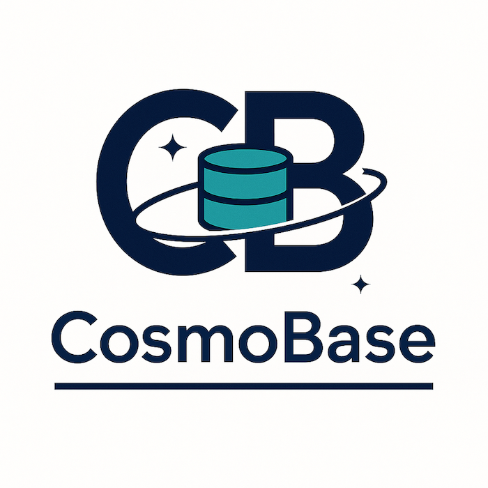

<p align="center">
  
</p>

# CosmoBase

[](https://github.com/tziazas/CosmoBase/actions)
[](https://www.nuget.org/packages/CosmoBase)
[](LICENSE)

**CosmoBase** – Enterprise-grade Azure Cosmos DB library with advanced caching, validation, bulk operations, intelligent soft-delete handling, and comprehensive audit field management.

---

## 🏆 Features

### **Core Capabilities**
- **Named read/write clients**: Configure multiple Cosmos endpoints (primary, replicas, emulator, etc.)
- **Per-model routing**: Route reads and writes to different endpoints via configuration
- **High-performance bulk operations**: Parallel upsert/insert with comprehensive error handling
- **Intelligent caching**: Age-based count caching with automatic invalidation
- **Advanced validation**: Comprehensive document and parameter validation with extensible rules

### **Query & Paging**
- **Continuation-token paging**: Efficient, server-side paging without re-scanning
- **LINQ & SQL queries**: Expression-based or raw SQL, streamed as `IAsyncEnumerable<T>`
- **Flexible filtering**: Array property queries and dynamic property comparisons
- **Soft-delete awareness**: Consistent filtering across all query methods

### **Enterprise Features**
- **Comprehensive audit trails**: Automatic `CreatedOnUtc`, `UpdatedOnUtc`, `CreatedBy`, `UpdatedBy` field management
- **Flexible user context**: Support for web applications, background services, and custom user resolution
- **Soft-delete support**: Configurable soft-delete with `includeDeleted` parameters
- **Comprehensive retry policies**: Polly-based retry with exponential backoff
- **Metrics & observability**: Built-in telemetry and performance monitoring
- **DTO ↔ DAO mapping**: Zero-dependency default mapper or bring your own (AutoMapper, Mapster)

### **Developer Experience**
- **Resource management**: Automatic disposal of Cosmos clients and resources
- **Extensive validation**: Early detection of configuration and data issues
- **Rich error handling**: Detailed error messages with context and suggestions
- **Type safety**: Strong typing throughout with compile-time validation

---

## 🚀 Installation

From the command line:

```bash
dotnet add package CosmoBase
```

Or via NuGet Package Manager in Visual Studio:

```
Install-Package CosmoBase
```

---

## 📖 Quickstart

### 1. Add your configuration

In `appsettings.json`:

```jsonc
{
  "CosmoBase": {
    "CosmosClientConfigurations": [
      {
        "Name": "Primary",
        "ConnectionString": "AccountEndpoint=https://myaccount.documents.azure.com:443/;AccountKey=mykey==;",
        "NumberOfWorkers": 10,
        "AllowBulkExecution": true,
        "ConnectionMode": "Direct",
        "MaxRetryAttempts": 5,
        "MaxRetryWaitTimeInSeconds": 30
      },
      {
        "Name": "ReadReplica",
        "ConnectionString": "AccountEndpoint=https://myaccount-eastus.documents.azure.com:443/;AccountKey=mykey2==;",
        "NumberOfWorkers": 5,
        "AllowBulkExecution": false,
        "ConnectionMode": "Direct",
        "MaxRetryAttempts": 3,
        "MaxRetryWaitTimeInSeconds": 15
      }
    ],
    "CosmosModelConfigurations": [
      {
        "ModelName": "Product",
        "DatabaseName": "ProductCatalog",
        "CollectionName": "Products",
        "PartitionKey": "/category",
        "ReadCosmosClientConfigurationName": "ReadReplica",
        "WriteCosmosClientConfigurationName": "Primary"
      },
      {
        "ModelName": "Order",
        "DatabaseName": "OrderManagement",
        "CollectionName": "Orders",
        "PartitionKey": "/customerId",
        "ReadCosmosClientConfigurationName": "Primary",
        "WriteCosmosClientConfigurationName": "Primary"
      }
    ]
  }
}
```

### 2. Register CosmoBase with User Context

**CosmoBase requires a user context for audit field tracking.** Choose the approach that fits your application:

#### **Web Applications:**
```csharp
using CosmoBase.DependencyInjection;
using CosmoBase.Abstractions.Interfaces;
using CosmoBase.Services;

var builder = WebApplication.CreateBuilder(args);

// Custom user context that reads from HTTP context
public class WebUserContext : IUserContext
{
    private readonly IHttpContextAccessor _httpContextAccessor;
    
    public WebUserContext(IHttpContextAccessor httpContextAccessor)
    {
        _httpContextAccessor = httpContextAccessor;
    }
    
    public string? GetCurrentUser()
    {
        var context = _httpContextAccessor.HttpContext;
        return context?.User?.Identity?.Name 
            ?? context?.User?.FindFirst("sub")?.Value 
            ?? "Anonymous";
    }
}

// Register HTTP context accessor and custom user context
builder.Services.AddHttpContextAccessor();
var userContext = new WebUserContext(serviceProvider.GetRequiredService<IHttpContextAccessor>());

// Register CosmoBase with user context
builder.Services.AddCosmoBase(
    builder.Configuration, 
    userContext,
    config =>
    {
        // Optional: Override specific settings
        config.CosmosClientConfigurations
              .First(c => c.Name == "Primary")
              .NumberOfWorkers = 12;
    });

var app = builder.Build();
```

#### **Background Services / Console Applications:**
```csharp
var builder = Host.CreateApplicationBuilder(args);

// Use system user context for background services
builder.Services.AddCosmoBaseWithSystemUser(
    builder.Configuration, 
    "DataProcessor"); // System user name

var host = builder.Build();
```

#### **Custom User Resolution:**
```csharp
var builder = WebApplication.CreateBuilder(args);

// Use delegate for custom user resolution logic
builder.Services.AddCosmoBaseWithUserProvider(
    builder.Configuration,
    () => 
    {
        // Your custom logic to resolve current user
        return GetCurrentUserFromJwt() ?? "System";
    });

var app = builder.Build();
```

### 3. Use Data Services (Recommended)

**High-level data services** provide the best developer experience with automatic audit field management:

```csharp
public class ProductService
{
    private readonly IDataReadService<Product>  _reader;
    private readonly IDataWriteService<Product> _writer;

    public ProductService(
        IDataReadService<Product> reader,
        IDataWriteService<Product> writer)
    {
        _reader = reader;
        _writer = writer;
    }

    public async Task ProcessProductsAsync()
    {
        // Bulk save with automatic validation, retry, and audit fields
        var newProducts = GetNewProductDtos();
        await _writer.SaveAsync(newProducts);
        // CreatedOnUtc, UpdatedOnUtc, CreatedBy, UpdatedBy automatically set

        // Stream products with intelligent caching
        await foreach (var product in _reader.GetAllAsyncEnumerable(
            cancellationToken: CancellationToken.None,
            limit: 100, offset: 0, count: 500))
        {
            await ProcessProduct(product);
        }

        // Get cached count (15-minute cache)
        var totalCount = await _reader.GetCountAsync("electronics", cacheMinutes: 15);
    }
}
```

### 4. Use Repository Directly (Advanced)

For advanced scenarios requiring more control:

```csharp
public class AdvancedProductService
{
    private readonly ICosmosRepository<ProductDocument> _repository;

    public AdvancedProductService(ICosmosRepository<ProductDocument> repository)
    {
        _repository = repository;
    }

    public async Task AdvancedOperationsAsync()
    {
        // Get item with soft-delete control
        var product = await _repository.GetItemAsync(
            "product123", 
            "electronics", 
            includeDeleted: false);

        // Intelligent cached count with custom expiry
        var count = await _repository.GetCountWithCacheAsync(
            "electronics", 
            cacheExpiryMinutes: 30);

        // Query with array property filtering
        var premiumProducts = await _repository.GetAllByArrayPropertyAsync(
            "tags", 
            "category", 
            "premium",
            includeDeleted: false);

        // Create with automatic audit fields
        var newProduct = new ProductDocument 
        { 
            Id = "new-product", 
            Category = "electronics" 
        };
        await _repository.CreateItemAsync(newProduct);
        // CreatedOnUtc, UpdatedOnUtc, CreatedBy, UpdatedBy automatically populated

        // Bulk operations with detailed error handling and audit fields
        try
        {
            await _repository.BulkUpsertAsync(
                products, 
                "electronics", 
                batchSize: 50, 
                maxConcurrency: 10);
        }
        catch (CosmoBaseException ex) when (ex.Data.Contains("BulkUpsertResult"))
        {
            var result = (BulkExecuteResult<ProductDocument>)ex.Data["BulkUpsertResult"];
            HandlePartialFailure(result);
        }

        // Custom LINQ queries
        var expensiveProducts = _repository.Queryable
            .Where(p => p.Price > 1000 && !p.Deleted)
            .ToAsyncEnumerable();
    }
}
```

---

## 🔧 Advanced Features

### **Comprehensive Audit Field Management**

CosmoBase automatically manages audit fields across all operations:

```csharp
// All CRUD operations automatically set audit fields
var product = new Product { Id = "123", Name = "Widget" };

// Create operation sets all fields
await repository.CreateItemAsync(product);
// Result: CreatedOnUtc, UpdatedOnUtc, CreatedBy, UpdatedBy all populated

// Update operation sets modified fields only
product.Name = "Updated Widget";
await repository.ReplaceItemAsync(product);
// Result: UpdatedOnUtc and UpdatedBy updated, CreatedOnUtc/CreatedBy preserved

// Upsert operation intelligently determines create vs update
await repository.UpsertItemAsync(product);
// Result: Automatically handles create vs update audit field logic

// Bulk operations handle audit fields for all items
await repository.BulkInsertAsync(products, "partition");
// Result: All items get proper audit fields based on operation type
```

### **Flexible User Context Options**

Choose the user context approach that fits your application:

```csharp
// 1. System user for background services
services.AddCosmoBaseWithSystemUser(configuration, "BackgroundService");

// 2. Delegate function for custom logic
services.AddCosmoBaseWithUserProvider(configuration, () => 
{
    return HttpContext.Current?.User?.Identity?.Name ?? "Anonymous";
});

// 3. Custom implementation for complex scenarios
public class JwtUserContext : IUserContext
{
    public string? GetCurrentUser()
    {
        // Extract user from JWT, database, etc.
        return ExtractUserFromToken();
    }
}
services.AddCosmoBase(configuration, new JwtUserContext());

// 4. Different contexts for different scenarios
#if DEBUG
    services.AddCosmoBase(configuration, new SystemUserContext("Development"));
#else
    services.AddCosmoBase(configuration, new ProductionUserContext());
#endif
```

### **Intelligent Caching**

Built-in count caching with age-based invalidation:

```csharp
// Cache for 15 minutes, auto-invalidated on mutations
var count = await repository.GetCountWithCacheAsync("partition", 15);

// Force fresh count (bypass cache)
var freshCount = await repository.GetCountWithCacheAsync("partition", 0);

// Manual cache invalidation (automatic after creates/deletes)
repository.InvalidateCountCache("partition");
```

### **Comprehensive Validation**

Extensible validation system with detailed error reporting:

```csharp
// Custom validator example
public class ProductValidator : CosmosValidator<Product>
{
    public override void ValidateDocument(Product item, string operation, string partitionKeyProperty)
    {
        base.ValidateDocument(item, operation, partitionKeyProperty);
        
        // Custom business rules
        if (string.IsNullOrEmpty(item.Name))
            throw new ArgumentException("Product name is required");
            
        if (item.Price <= 0)
            throw new ArgumentException("Product price must be positive");
    }
}

// Register custom validator
services.AddSingleton<ICosmosValidator<Product>, ProductValidator>();
```

### **Soft Delete Support**

Consistent soft-delete handling across all operations:

```csharp
// Get active items only (default)
var activeProducts = await repository.GetAllByArrayPropertyAsync(
    "categories", "type", "electronics");

// Include soft-deleted items
var allProducts = await repository.GetAllByArrayPropertyAsync(
    "categories", "type", "electronics", includeDeleted: true);

// Soft delete vs hard delete
await repository.DeleteItemAsync("id", "partition", DeleteOptions.SoftDelete);
await repository.DeleteItemAsync("id", "partition", DeleteOptions.HardDelete);
```

### **Bulk Operations with Error Handling**

High-performance bulk operations with comprehensive error reporting:

```csharp
try
{
    await repository.BulkInsertAsync(documents, "partition");
}
catch (CosmoBaseException ex) when (ex.Data.Contains("BulkInsertResult"))
{
    var result = (BulkExecuteResult<Document>)ex.Data["BulkInsertResult"];
    
    Console.WriteLine($"Success rate: {result.SuccessRate:F1}%");
    Console.WriteLine($"Total RUs consumed: {result.TotalRequestUnits}");
    
    // Retry failed items that are retryable
    var retryableItems = result.FailedItems
        .Where(f => f.IsRetryable)
        .Select(f => f.Item);
    
    if (retryableItems.Any())
    {
        await repository.BulkInsertAsync(retryableItems, "partition");
    }
}
```

### **Observability & Metrics**

Built-in telemetry for monitoring and performance optimization:

```csharp
// Metrics automatically tracked:
// - cosmos.request_charge (RU consumption)
// - cosmos.retry_count (Retry attempts)
// - cosmos.cache_hit_count (Cache effectiveness)
// - cosmos.cache_miss_count (Cache misses)

// Access via standard .NET metrics APIs
// Compatible with OpenTelemetry, Prometheus, Azure Monitor
```

---

## 🛠 Configuration Reference

<details>
<summary><strong>CosmosClientConfiguration</strong></summary>

| Property                      | Type      | Description                                                                                          | Default |
| ----------------------------- | --------- | ---------------------------------------------------------------------------------------------------- | ------- |
| `Name`                        | `string`  | Unique name for this client configuration                                                           | Required |
| `ConnectionString`            | `string`  | Cosmos DB connection string                                                                          | Required |
| `NumberOfWorkers`             | `int`     | Degree of parallelism for bulk operations (1-100)                                                   | Required |
| `AllowBulkExecution`          | `bool?`   | Enable bulk operations for better throughput                                                         | `true` |
| `ConnectionMode`              | `string?` | Connection mode: "Direct" or "Gateway". Direct is faster, Gateway works better through firewalls    | `"Direct"` |
| `MaxRetryAttempts`            | `int?`    | Maximum retry attempts for rate-limited requests (0-20)                                             | `9` |
| `MaxRetryWaitTimeInSeconds`   | `int?`    | Maximum wait time in seconds for retries (1-300)                                                    | `30` |

</details>

<details>
<summary><strong>CosmosModelConfiguration</strong></summary>

| Property                              | Description                                                            |
| ------------------------------------- | ---------------------------------------------------------------------- |
| `ModelName`                           | Identifier used in code/registration (must match your DTO type)        |
| `DatabaseName`                        | Name of the Cosmos DB database                                         |
| `CollectionName`                      | Name of the container/collection                                       |
| `PartitionKey`                        | Partition key path (e.g. `/category`)                                  |
| `ReadCosmosClientConfigurationName`   | Name of the client to use for read operations                          |
| `WriteCosmosClientConfigurationName`  | Name of the client to use for write operations                         |

</details>

---

## 🧪 Testing

### **Unit Testing with Custom Configuration**

```csharp
[TestClass]
public class CosmosTests
{
    private ServiceProvider _serviceProvider;
    
    [TestInitialize]
    public void Setup()
    {
        var services = new ServiceCollection();
        
        // Configure for Cosmos DB emulator with test user context
        services.AddCosmoBase(
            new SystemUserContext("TestUser"),
            options =>
            {
                options.CosmosClientConfigurations = new[]
                {
                    new CosmosClientConfiguration
                    {
                        Name = "Test",
                        ConnectionString = "AccountEndpoint=https://localhost:8081/;AccountKey=C2y6yDjf5/R+ob0N8A7Cgv30VRDJIWEHLM+4QDU5DE2nQ9nDuVTqobD4b8mGGyPMbIZnqyMsEcaGQy67XIw/Jw==",
                        NumberOfWorkers = 1,
                        AllowBulkExecution = false,
                        ConnectionMode = "Gateway"
                    }
                };
                
                options.CosmosModelConfigurations = new[]
                {
                    new CosmosModelConfiguration
                    {
                        ModelName = "Product",
                        DatabaseName = "TestDb",
                        CollectionName = "TestContainer",
                        PartitionKey = "/category",
                        ReadCosmosClientConfigurationName = "Test",
                        WriteCosmosClientConfigurationName = "Test"
                    }
                };
            });
        
        _serviceProvider = services.BuildServiceProvider();
    }
    
    [TestMethod]
    public async Task TestProductOperations()
    {
        var repository = _serviceProvider.GetRequiredService<ICosmosRepository<Product>>();
        
        // Test with validation and audit fields
        var product = new Product { Id = "test", Category = "electronics" };
        var result = await repository.CreateItemAsync(product);
        
        // Verify audit fields were set
        Assert.IsNotNull(result.CreatedOnUtc);
        Assert.IsNotNull(result.UpdatedOnUtc);
        Assert.AreEqual("TestUser", result.CreatedBy);
        Assert.AreEqual("TestUser", result.UpdatedBy);
        Assert.IsFalse(result.Deleted);
        
        // Test cached count
        var count = await repository.GetCountWithCacheAsync("electronics", 0);
        Assert.AreEqual(1, count);
    }
}
```

### **Mocking for Unit Tests**

```csharp
[TestMethod]
public async Task TestServiceWithMockedRepository()
{
    // Mock the repository
    var mockRepo = new Mock<ICosmosRepository<Product>>();
    mockRepo.Setup(r => r.GetCountWithCacheAsync("electronics", 15, default))
           .ReturnsAsync(42);
    
    var service = new ProductService(mockRepo.Object);
    var count = await service.GetProductCountAsync("electronics");
    
    Assert.AreEqual(42, count);
}
```

---

## 🚀 Performance Best Practices

### **Audit Field Management**
- User context resolution is cached per operation - no performance penalty
- Audit fields are set in-memory before Cosmos DB operations
- Use `SystemUserContext` for background services to avoid HTTP context overhead

### **Bulk Operations**
- Use batch sizes of 50-100 for optimal throughput
- Limit concurrency to 10-20 to avoid overwhelming Cosmos DB
- Handle partial failures gracefully with retry logic

### **Caching**
- Use 5-15 minute cache expiry for frequently changing data
- Use 30-60 minute cache expiry for stable reference data
- Monitor cache hit rates with built-in metrics

### **Querying**
- Use specific partition keys whenever possible
- Leverage soft-delete filtering for consistent behavior
- Stream large result sets with `IAsyncEnumerable<T>`

### **Resource Management**
- CosmoBase automatically disposes resources
- Use dependency injection for proper lifecycle management
- Monitor RU consumption with built-in telemetry

---

## 📊 Migration Guide

### **From Version 1.x to 2.x**

**Breaking Change: Required User Context**

Version 2.0 introduces comprehensive audit field management, which requires specifying a user context:

```csharp
// Before (v1.x)
services.AddCosmoBase(configuration);

// After (v2.x) - Background service
services.AddCosmoBaseWithSystemUser(configuration, "MyService");

// After (v2.x) - Web application
services.AddCosmoBase(configuration, new WebUserContext(httpContextAccessor));

// After (v2.x) - Custom logic
services.AddCosmoBaseWithUserProvider(configuration, () => GetCurrentUser());
```

**Other Changes:**

```csharp
// Enhanced count operations with caching
var count = await repository.GetCountWithCacheAsync("partition", 15);

// Consistent soft-delete parameters
var items = await repository.GetAllByArrayPropertyAsync("tags", "type", "premium", includeDeleted: false);

// Automatic audit field management
var product = await repository.CreateItemAsync(item);
// CreatedOnUtc, UpdatedOnUtc, CreatedBy, UpdatedBy automatically populated
```

---

## 📄 License

This project is licensed under the [Apache License](LICENSE).

---

## 🤝 Contributing

Contributions, issues, and feature requests are welcome! Please open an issue or submit a pull request.

### **Development Setup**

1. Clone the repository
2. Install .NET 9.0 SDK
3. Run Cosmos DB emulator locally
4. Execute tests: `dotnet test`

### **Contribution Guidelines**

- Follow existing code style and patterns
- Add unit tests for new features
- Update documentation for public APIs
- Ensure all tests pass before submitting PRs

---

<p align="center">
  Made with ❤️ and 🚀 by Achilleas Tziazas
</p>