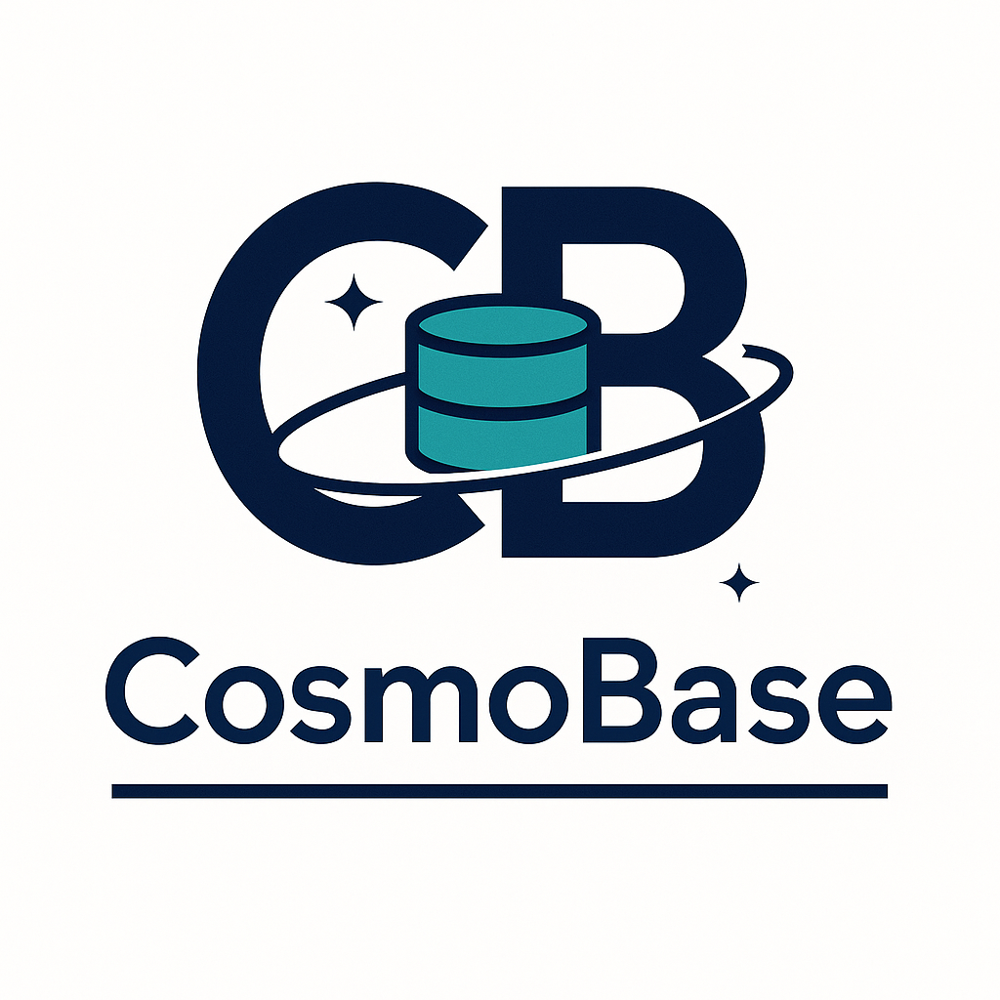

  


# CosmoBase

[](https://github.com/tziazas/CosmoBase/actions)
[](https://www.nuget.org/packages/CosmoBase)
[](LICENSE)

**CosmoBase** — Enterprise-grade Azure Cosmos DB library for .NET 9. Repository pattern, bulk operations, soft delete, audit trails, intelligent caching, and strongly-typed query abstractions — wired up with a single `AddCosmoBase()` call.

---

## Why CosmoBase?

Every project ends up building the same patterns: audit fields, validation, bulk operations, caching, retry handling. CosmoBase centralizes that boilerplate so you can focus on business logic.

**Without CosmoBase:**
```csharp
var response = await container.CreateItemAsync(item);
item.CreatedOnUtc = DateTime.UtcNow;
item.CreatedBy = currentUser;
// ...50+ lines of boilerplate per operation, duplicated across every project
```

**With CosmoBase:**
```csharp
var created = await _writer.CreateAsync(product);
// Audit fields, validation, SDK retry — handled automatically
```

---

## Table of Contents

- [Features](#features)
- [Installation](#installation)
- [Getting Started](#getting-started)
  - [1. Define Your Models](#1-define-your-models)
  - [2. Configure](#2-configure)
  - [3. Register Services](#3-register-services)
  - [4. Basic Usage](#4-basic-usage)
- [Read Operations](#read-operations)
- [Write Operations](#write-operations)
- [Advanced Features](#advanced-features)
- [Configuration Reference](#configuration-reference)
- [Troubleshooting](#troubleshooting)
- [Performance Best Practices](#performance-best-practices)
- [Migration & Versioning](#migration--versioning)
- [License](#license)
- [Contributing](#contributing)

---

## Features

### Core Capabilities
- **Named read/write clients** — configure multiple Cosmos endpoints (primary, replicas, emulator)
- **Per-model routing** — route reads and writes to different endpoints via configuration
- **High-performance bulk operations** — parallel upsert/insert with comprehensive error handling
- **Intelligent caching** — `IMemoryCache`-backed count caching with automatic TTL and write-through invalidation
- **Extensible validation** — per-document validation with configurable business rules

### Query & Paging
- **Continuation-token pagination** — efficient server-side paging without re-scanning
- **SQL queries** — parameterized `SqlSpecification<T>` streamed as `IAsyncEnumerable<T>`
- **LINQ queries** — `IQueryable<T>` over the container for custom expressions (repository level)
- **Flexible filtering** — array property queries and dynamic property comparisons with `PropertyFilter`
- **Soft-delete awareness** — consistent `includeDeleted` filtering across all query methods

### Enterprise Features
- **Automatic audit trails** — `CreatedOnUtc`, `UpdatedOnUtc`, `CreatedBy`, `UpdatedBy` on every operation
- **Flexible user context** — HTTP context, system user, or delegate — your choice
- **Soft delete** — configurable soft delete with ETag-based optimistic concurrency on the underlying replace
- **Built-in retry** — Cosmos SDK's built-in rate-limit retry with configurable attempts and wait time
- **Metrics & observability** — `System.Diagnostics.Metrics` histograms and counters compatible with OpenTelemetry, Prometheus, and Azure Monitor

### Developer Experience
- **DTO ↔ DAO mapping** — zero-dependency default mapper (System.Text.Json round-trip) or bring your own
- **Strong typing** — generic services and repositories with compile-time type safety
- **Rich error handling** — `CosmoBaseException` with structured data for programmatic retry logic
- **Patch operations** — targeted field updates and array element patches via Cosmos DB server-side patch

---

## Installation

```bash
dotnet add package CosmoBase
```

Or via NuGet Package Manager:

```
Install-Package CosmoBase
```

---

## Getting Started

### 1. Define Your Models

Every document stored in Cosmos DB must have a DAO (Data Access Object) that implements `ICosmosDataModel`. Your application works with a separate DTO (Data Transfer Object) — CosmoBase handles the mapping automatically.

```csharp
using System.Text.Json.Serialization;
using CosmoBase.Abstractions.Interfaces;

// DAO — stored in Cosmos DB. Must implement ICosmosDataModel.
public class ProductDao : ICosmosDataModel
{
    [JsonPropertyName("id")]          // Required: Cosmos DB expects lowercase "id"
    public string Id { get; set; } = string.Empty;

    public string Name { get; set; } = string.Empty;
    public decimal Price { get; set; }
    public string Category { get; set; } = string.Empty; // partition key property

    // Audit fields — CosmoBase sets these automatically. Never set them manually.
    public DateTime? CreatedOnUtc { get; set; }
    public DateTime? UpdatedOnUtc { get; set; }
    public string? CreatedBy { get; set; }
    public string? UpdatedBy { get; set; }
    public bool Deleted { get; set; }
}

// DTO — your application-facing model. No audit fields required.
public class Product
{
    public string Id { get; set; } = string.Empty;
    public string Name { get; set; } = string.Empty;
    public decimal Price { get; set; }
    public string Category { get; set; } = string.Empty;
}
```

> **Important:** `ModelName` in configuration must match your DAO class name exactly (e.g., `"ProductDao"`, not `"Product"`).

---

### 2. Configure

In `appsettings.json`:

```jsonc
{
  "CosmoBase": {
    "CosmosClientConfigurations": [
      {
        "Name": "Primary",
        "ConnectionString": "AccountEndpoint=https://myaccount.documents.azure.com:443/;AccountKey=mykey==;",
        "NumberOfWorkers": 10,
        "AllowBulkExecution": true,
        "ConnectionMode": "Direct",
        "MaxRetryAttempts": 9,
        "MaxRetryWaitTimeInSeconds": 30
      },
      {
        "Name": "ReadReplica",
        "ConnectionString": "AccountEndpoint=https://myaccount-eastus.documents.azure.com:443/;AccountKey=mykey2==;",
        "NumberOfWorkers": 5,
        "AllowBulkExecution": false,
        "ConnectionMode": "Direct",
        "MaxRetryAttempts": 3,
        "MaxRetryWaitTimeInSeconds": 15
      }
    ],
    "CosmosModelConfigurations": [
      {
        "ModelName": "ProductDao",
        "DatabaseName": "ProductCatalog",
        "CollectionName": "Products",
        "PartitionKey": "Category",
        "ReadCosmosClientConfigurationName": "ReadReplica",
        "WriteCosmosClientConfigurationName": "Primary"
      },
      {
        "ModelName": "OrderDao",
        "DatabaseName": "OrderManagement",
        "CollectionName": "Orders",
        "PartitionKey": "CustomerId",
        "ReadCosmosClientConfigurationName": "Primary",
        "WriteCosmosClientConfigurationName": "Primary"
      }
    ]
  }
}
```

> **Common pitfalls:**
> - `ModelName` must match the DAO class name exactly — `"ProductDao"`, not `"Product"`
> - `PartitionKey` accepts either the **Cosmos JSON field name** or the **C# property name**. If your DAO uses `[JsonPropertyName("btLockboxNumber")] public string? Lockbox { get; set; }`, you may use either `"btLockboxNumber"` or `"Lockbox"` in config — both resolve correctly. Do **not** include the leading `/` (e.g. `"Category"`, not `"/category"`).
> - Read-only summary models that aggregate across a collection do not need to include the partition key property — omit it freely and CosmoBase will not require it at startup or query time.

---

### 3. Register Services

CosmoBase requires a user context for audit field tracking. Choose the approach that fits your application.

#### Web Applications

```csharp
using CosmoBase.Abstractions.Interfaces;
using CosmoBase.DependencyInjection;
using Microsoft.AspNetCore.Http;
using System.Security.Claims;

// Implement IUserContext to extract the current user from the HTTP request
public class WebUserContext : IUserContext
{
    private readonly IHttpContextAccessor _accessor;

    public WebUserContext(IHttpContextAccessor accessor)
        => _accessor = accessor;

    public string? GetCurrentUser()
    {
        var ctx = _accessor.HttpContext;
        if (ctx?.User.Identity?.IsAuthenticated == true)
        {
            return ctx.User.FindFirst(ClaimTypes.NameIdentifier)?.Value
                ?? ctx.User.FindFirst("sub")?.Value
                ?? ctx.User.Identity.Name;
        }
        return "Anonymous";
    }
}
```

```csharp
var builder = WebApplication.CreateBuilder(args);

builder.Services.AddHttpContextAccessor();

// IHttpContextAccessor uses static AsyncLocal state — safe to instantiate directly
var userContext = new WebUserContext(new HttpContextAccessor());

builder.Services.AddCosmoBase(builder.Configuration, userContext);
```

#### Background Services / Console Applications

```csharp
var builder = Host.CreateApplicationBuilder(args);

builder.Services.AddCosmoBaseWithSystemUser(
    builder.Configuration,
    systemUserName: "DataProcessor"); // Appears in audit fields
```

#### Custom Delegate

```csharp
builder.Services.AddCosmoBaseWithUserProvider(
    builder.Configuration,
    () => ResolveCurrentUserFromJwt() ?? "System");
```

#### Programmatic Configuration (no appsettings.json)

```csharp
builder.Services.AddCosmoBase(
    configureOptions: config =>
    {
        config.CosmosClientConfigurations = new List<CosmosClientConfiguration>
        {
            new() { Name = "Primary", ConnectionString = "...", NumberOfWorkers = 10 }
        };
        config.CosmosModelConfigurations = new List<CosmosModelConfiguration>
        {
            new()
            {
                ModelName = "ProductDao",
                DatabaseName = "MyDb",
                CollectionName = "Products",
                PartitionKey = "Category",
                ReadCosmosClientConfigurationName = "Primary",
                WriteCosmosClientConfigurationName = "Primary"
            }
        };
    },
    userContext: new SystemUserContext("System"));
```

---

### 4. Basic Usage

Inject `ICosmosDataReadService<TDto, TDao>` and `ICosmosDataWriteService<TDto, TDao>` into your services:

```csharp
public class ProductService
{
    private readonly ICosmosDataReadService<Product, ProductDao> _reader;
    private readonly ICosmosDataWriteService<Product, ProductDao> _writer;

    public ProductService(
        ICosmosDataReadService<Product, ProductDao> reader,
        ICosmosDataWriteService<Product, ProductDao> writer)
    {
        _reader = reader;
        _writer = writer;
    }

    public async Task<Product> AddProductAsync(Product product)
    {
        // CreatedOnUtc, UpdatedOnUtc, CreatedBy, UpdatedBy set automatically
        return await _writer.CreateAsync(product);
    }

    public async Task<Product?> GetProductAsync(string id, string category)
    {
        return await _reader.GetByIdAsync(id, partitionKey: category);
    }
}
```

---

## Read Operations

### Get by ID

```csharp
// Returns null if the document is soft-deleted (default behavior)
var product = await _reader.GetByIdAsync("product-123", partitionKey: "electronics");

// Include soft-deleted documents
var deletedProduct = await _reader.GetByIdAsync("product-123", "electronics", includeDeleted: true);
```

### Stream All Documents

```csharp
// Scoped to a single partition — preferred for production use
await foreach (var product in _reader.GetAllAsync(partitionKey: "electronics"))
{
    await ProcessProduct(product);
}

// Cross-partition scan — fans out to every partition, high RU cost.
// A warning is logged each time this overload is called.
// Reserve for administrative tasks, migrations, or small containers.
await foreach (var product in _reader.GetAllAsync())
{
    await ProcessProduct(product);
}

// Offset/limit pagination with a stream cap
// pageSize: items per SDK round-trip (controls RU granularity)
// offset: items to skip before streaming starts
// maxItems: total items to yield across all pages
await foreach (var product in _reader.GetAllAsync(pageSize: 100, offset: 0, maxItems: 500))
{
    await ProcessProduct(product);
}
```

### Filter by Array Property

Find documents where an array field contains an element with a specific property value:

```csharp
// Finds Products where Tags[].Type == "premium"
var premiumProducts = await _reader.GetAllByArrayPropertyAsync(
    arrayName: "Tags",
    elementPropertyName: "Type",
    elementPropertyValue: "premium");
```

### Filter by Property Comparison

Build dynamic WHERE clauses using `PropertyFilter`:

```csharp
using CosmoBase.Abstractions.Filters;

var filters = new List<PropertyFilter>
{
    new() { PropertyName = "Price",    PropertyValue = 100m, PropertyComparison = PropertyComparison.GreaterThan },
    new() { PropertyName = "Category", PropertyValue = "electronics", PropertyComparison = PropertyComparison.Equal }
};

// Filters are combined with AND
var expensive = await _reader.GetAllByPropertyComparisonAsync(filters);
```

Available comparisons: `Equal`, `NotEqual`, `GreaterThan`, `LessThan`, `GreaterThanOrEqual`, `LessThanOrEqual`, `In`.

### SQL Specification Queries

For advanced filtering and sorting, use `SqlSpecification<T>` with parameterized queries:

```csharp
using CosmoBase.Abstractions.Filters;

// Always use parameterized queries — never interpolate values into the query string
var spec = new SqlSpecification<Product>(
    "SELECT * FROM c WHERE c.Category = @category AND c.Price > @minPrice ORDER BY c.Price",
    new Dictionary<string, object>
    {
        ["@category"] = "electronics",
        ["@minPrice"]  = 500m
    });

await foreach (var product in _reader.QueryAsync(spec))
{
    Console.WriteLine(product.Name);
}
```

### Bulk Read (High-Throughput Streaming)

Stream results in batches for high-volume processing:

```csharp
var spec = new SqlSpecification<Product>(
    "SELECT * FROM c WHERE c.Category = @category",
    new Dictionary<string, object> { ["@category"] = "electronics" });

await foreach (var batch in _reader.BulkReadAsyncEnumerable(
    spec,
    partitionKey: "electronics",
    batchSize: 500,
    maxConcurrency: 20))
{
    await ProcessBatch(batch); // batch is List<Product>
}
```

### Count Queries

```csharp
// Live count (excludes soft-deleted documents)
var activeCount = await _reader.GetCountAsync(partitionKeyValue: "electronics");

// Total count including soft-deleted documents
var totalCount = await _reader.GetTotalCountAsync(partitionKeyValue: "electronics");

// Cached count — returns cached value if available and not expired
var cachedCount = await _reader.GetCountWithCacheAsync(
    partitionKeyValue: "electronics",
    cacheExpiryMinutes: 15);  // Set to 0 to always bypass cache

// Manually invalidate the cache for a partition (e.g., after an external bulk load)
_reader.InvalidateCountCache("electronics");
```

> Write operations (create, upsert, delete, bulk) automatically invalidate the count cache.

### Continuation-Token Pagination

Efficient page-by-page navigation without re-scanning from the start:

```csharp
var spec = new SqlSpecification<Product>(
    "SELECT * FROM c WHERE c.Category = @cat ORDER BY c.Name",
    new Dictionary<string, object> { ["@cat"] = "electronics" });

string? token = null;

do
{
    var (items, nextToken) = await _reader.GetPageWithTokenAsync(
        spec,
        partitionKey: "electronics",
        pageSize: 25,
        continuationToken: token);

    await RenderPage(items);
    token = nextToken;

} while (token != null);
```

To get the total count on the first page only:

```csharp
var (items, nextToken, totalCount) = await _reader.GetPageWithTokenAndCountAsync(
    spec,
    partitionKey: "electronics",
    pageSize: 25,
    continuationToken: null); // totalCount is populated on first page only

Console.WriteLine($"Showing 1–{items.Count} of {totalCount} results");
```

---

## Write Operations

### Create, Replace, Upsert

```csharp
// Create — fails if a document with the same ID already exists
var created = await _writer.CreateAsync(new Product { Id = "p-1", Name = "Widget", Category = "tools" });

// Replace — fails if the document does not exist
product.Name = "Updated Widget";
var updated = await _writer.ReplaceAsync(product);

// Upsert — creates or replaces, handles audit fields correctly for both cases
var upserted = await _writer.UpsertAsync(product);
```

### Delete

```csharp
// Soft delete — marks Deleted = true, document remains queryable with includeDeleted: true
await _writer.DeleteAsync("product-123", "electronics", DeleteOptions.SoftDelete);

// Hard delete — permanently removes the document
await _writer.DeleteAsync("product-123", "electronics", DeleteOptions.HardDelete);
```

Soft-deleted documents are excluded from all standard queries. To undelete, retrieve the document with `includeDeleted: true` and upsert it back with `Deleted = false`.

### Patch Operations

Patch is ideal for targeted field updates on large documents — lower RU cost than a full replace.

```csharp
using CosmoBase.Abstractions.Filters;
using CosmoBase.Abstractions.Enums;

// Apply multiple patch operations atomically
var patch = new PatchSpecification(
[
    new PatchOperationSpecification("/Price",    PatchOperationType.Replace, 299.99m),
    new PatchOperationSpecification("/StockQty", PatchOperationType.Increment, -1),
    new PatchOperationSpecification("/Tags",     PatchOperationType.Add,     "sale"),
]);

var patched = await _writer.PatchDocumentAsync("product-123", "electronics", patch);
```

> **Note:** Patch operations do not automatically update audit fields (`UpdatedOnUtc`, `UpdatedBy`). Include those operations in your patch spec if needed, or use `ReplaceAsync` for automatic audit management.

#### Patch a Specific Array Element

```csharp
// Update the "Status" property of array element with Id == "item-456" in the "LineItems" array
var patched = await _writer.PatchDocumentListItemAsync(
    id:               "order-789",
    partitionKey:     "customer-001",
    listPropertyName: "LineItems",
    listItemId:       "item-456",
    parameterName:    "Status",
    replacementValue: "Shipped");
```

### Bulk Operations

High-throughput batch writes with automatic audit field management:

```csharp
// Bulk upsert — creates or replaces each document
await _writer.BulkUpsertAsync(
    products,
    partitionKeySelector: p => p.Category,
    configureItem: p => { p.LastSyncedAt = DateTime.UtcNow; }, // optional per-item setup
    batchSize: 100,
    maxConcurrency: 10);

// Bulk insert — fails if any document already exists
await _writer.BulkInsertAsync(
    newProducts,
    partitionKeySelector: p => p.Category);
```

Handle partial failures with structured error data:

```csharp
try
{
    await _writer.BulkUpsertAsync(products, p => p.Category);
}
catch (CosmoBaseException ex) when (ex.Data.Contains("BulkUpsertResult"))
{
    var result = (BulkExecuteResult<ProductDao>)ex.Data["BulkUpsertResult"]!;

    Console.WriteLine($"Succeeded: {result.SuccessCount}, Failed: {result.FailedCount}");
    Console.WriteLine($"RUs consumed: {result.TotalRequestUnits:F2}");

    // Retry only transient failures
    var retryable = result.FailedItems
        .Where(f => f.IsRetryable)
        .Select(f => f.Item);

    if (retryable.Any())
        await _writer.BulkInsertAsync(retryable, p => p.Category);
}
```

---

## Advanced Features

### Using the Repository Directly

`ICosmosRepository<TDao>` gives you lower-level access with full control. Use it when the data service layer doesn't expose what you need, or when working with DAOs directly in internal services.

```csharp
public class AdvancedProductService
{
    private readonly ICosmosRepository<ProductDao> _repo;

    public AdvancedProductService(ICosmosRepository<ProductDao> repo)
        => _repo = repo;

    public async Task DoWorkAsync()
    {
        // LINQ queries over the container
        var expensive = _repo.Queryable
            .Where(p => p.Price > 1000 && !p.Deleted)
            .ToAsyncEnumerable();

        // Specification-based stream (DAO types)
        var spec = new SqlSpecification<ProductDao>(
            "SELECT * FROM c WHERE c.Category = @cat",
            new Dictionary<string, object> { ["@cat"] = "electronics" });

        await foreach (var dao in _repo.QueryAsync(spec))
            await Process(dao);
    }
}
```

### Custom Validation

Override `CosmosValidator<T>` to add business-rule validation that runs before every write operation:

```csharp
public class ProductValidator : CosmosValidator<ProductDao>
{
    public override void ValidateDocument(ProductDao item, string operation, string partitionKeyProperty)
    {
        base.ValidateDocument(item, operation, partitionKeyProperty);

        if (string.IsNullOrEmpty(item.Name))
            throw new ArgumentException("Product name is required.");

        if (item.Price <= 0)
            throw new ArgumentException("Product price must be positive.");
    }
}

// Register before AddCosmoBase — TryAdd means this takes precedence over the default
services.AddSingleton<ICosmosValidator<ProductDao>, ProductValidator>();
services.AddCosmoBase(configuration, userContext);
```

### Custom DTO/DAO Mapper

CosmoBase ships with a `DefaultItemMapper<TDto, TDao>` that serializes to JSON and back (zero reflection at call time). Swap it for AutoMapper, Mapster, or hand-written mappings:

```csharp
public class ProductMapper : IItemMapper<Product, ProductDao>
{
    public ProductDao ToDao(Product dto) => new ProductDao
    {
        Id = dto.Id, Name = dto.Name, Price = dto.Price, Category = dto.Category
    };

    public Product ToDto(ProductDao dao) => new Product
    {
        Id = dao.Id, Name = dao.Name, Price = dao.Price, Category = dao.Category
    };

    // Async stream overloads are provided in the interface
    public async IAsyncEnumerable<Product> FromDaosAsync(
        IAsyncEnumerable<ProductDao> daos,
        [EnumeratorCancellation] CancellationToken ct = default)
    {
        await foreach (var dao in daos.WithCancellation(ct))
            yield return ToDto(dao);
    }
}

// Register before AddCosmoBase — TryAdd means this takes precedence
services.AddSingleton<IItemMapper<Product, ProductDao>, ProductMapper>();
services.AddCosmoBase(configuration, userContext);
```

### Observability & Metrics

CosmoBase emits the following `System.Diagnostics.Metrics` instruments under the meter `CosmoBase.CosmosRepository`:

| Metric | Type | Unit | Description |
|--------|------|------|-------------|
| `cosmos.request_charge` | Histogram | RU | RUs consumed per Cosmos call |
| `cosmos.retry_count` | Counter | count | SDK-level retries on rate-limited requests |
| `cosmos.cache_hit_count` | Counter | count | Count cache hits |
| `cosmos.cache_miss_count` | Counter | count | Count cache misses |

Wire them up to your preferred backend:

```csharp
// OpenTelemetry
builder.Services.AddOpenTelemetry()
    .WithMetrics(m => m.AddMeter("CosmoBase.CosmosRepository"));

// Prometheus (via prometheus-net)
Metrics.DefaultRegistry.AddMeter("CosmoBase.CosmosRepository");
```

---

## Configuration Reference

<details>
<summary><strong>CosmosClientConfiguration</strong></summary>

| Property | Type | Description | Default |
|----------|------|-------------|---------|
| `Name` | `string` | Unique name for this client configuration | Required |
| `ConnectionString` | `string` | Cosmos DB connection string | Required |
| `NumberOfWorkers` | `int` | Degree of parallelism for bulk operations (1–100) | Required |
| `AllowBulkExecution` | `bool?` | Enable bulk execution mode for better throughput | `true` |
| `ConnectionMode` | `string?` | `"Direct"` (faster) or `"Gateway"` (firewall-friendly) | `"Direct"` |
| `MaxRetryAttempts` | `int?` | Max SDK retry attempts on rate-limited requests (0–20) | `9` |
| `MaxRetryWaitTimeInSeconds` | `int?` | Max total wait time for retries (1–300 seconds) | `30` |

</details>

<details>
<summary><strong>CosmosModelConfiguration</strong></summary>

| Property | Description |
|----------|-------------|
| `ModelName` | **Must match your DAO class name exactly** (e.g., `"ProductDao"`) |
| `DatabaseName` | Name of the Cosmos DB database |
| `CollectionName` | Name of the container |
| `PartitionKey` | **Property name on your DAO** (e.g., `"Category"`, not `"/category"`) |
| `ReadCosmosClientConfigurationName` | Name of the client for read operations |
| `WriteCosmosClientConfigurationName` | Name of the client for write operations |

</details>

---

## Troubleshooting

### BadRequest (400) errors
- Verify `ModelName` matches your DAO class name exactly (`"ProductDao"`, not `"Product"`)
- Verify `PartitionKey` is the property name, not the path (`"Category"`, not `"/category"`)
- Confirm your DAO implements `ICosmosDataModel` with `[JsonPropertyName("id")]` on the `Id` property
- Confirm the container partition key path matches your DAO property (case-sensitive)

### Documents not found / wrong results
- Check whether soft-delete filtering is hiding documents — use `includeDeleted: true` to inspect
- Verify the partition key value you're passing matches what's stored on the document

### Serialization issues
- CosmoBase configures `System.Text.Json` automatically — do not add a separate `JsonNamingPolicy.CamelCase` that conflicts with partition key casing
- Always decorate the `Id` property with `[JsonPropertyName("id")]`

### Service registration issues
- Register custom `ICosmosValidator<T>` or `IItemMapper<TDto, TDao>` **before** `AddCosmoBase()` — internal registrations use `TryAdd` so yours take precedence
- Use the exact generic types: `ICosmosDataReadService<TDto, TDao>` and `ICosmosDataWriteService<TDto, TDao>`

### Audit fields are empty
- Ensure your user context is correctly registered and `GetCurrentUser()` returns a non-null value
- For upsert, CosmoBase checks whether the document exists to decide create vs update audit logic

---

## Performance Best Practices

### Partition key discipline
- Pass the partition key explicitly on every single-item read (`GetByIdAsync`, `GetItemAsync`) — this is a direct point read and costs 1 RU
- Scope `GetAllAsync`, `QueryAsync`, and count operations to a partition key whenever possible
- Reserve the no-arg `GetAllAsync()` cross-partition scan for administrative tasks or small containers

### Bulk operations
- Batch sizes of 50–100 are optimal for most document sizes
- Keep `maxConcurrency` at 10–20 to avoid overwhelming your provisioned throughput
- Handle partial failures with the structured `BulkExecuteResult<T>` — retry only `IsRetryable` items

### Count caching
- Use `GetCountWithCacheAsync` for dashboards, pagination headers, or any display that doesn't need real-time accuracy
- 5–15 minute expiry for frequently-mutating partitions; 30–60 minutes for stable reference data
- Pass `cacheExpiryMinutes: 0` to bypass the cache and force a fresh query

### Patch vs Replace
- Use `PatchDocumentAsync` for high-frequency, small field updates (status changes, counters) — significantly lower RU cost
- Use `ReplaceAsync` when you need automatic audit field management or full document validation

### Streaming large result sets
- Prefer `IAsyncEnumerable<T>` methods (`GetAllAsync`, `QueryAsync`) for large datasets — they do not buffer the entire result set in memory
- Use `BulkReadAsyncEnumerable` for data-pipeline scenarios that benefit from parallel page fetching

---

## Migration & Versioning

### Breaking Changes Policy

CosmoBase follows semantic versioning. Breaking changes are documented with migration guides on major version bumps.

### Current Version: 0.1.4

Changes since 0.1.3:

- **Renamed parameters** on `GetAllAsync(int, int, int)` and `GetCountWithCacheAsync`: `limit` → `pageSize`, `count` → `maxItems` — improves clarity of each parameter's role
- **Soft delete ETag safety**: soft deletes now use a read-then-replace with `IfMatchEtag` to prevent lost-update races under concurrent writes
- **Count cache simplified**: `IMemoryCache` owns the TTL entirely; the internal `CachedCountEntry` wrapper has been removed
- **Newtonsoft.Json removed**: CosmoBase uses `System.Text.Json` exclusively; no Newtonsoft dependency
- **`new()` constraint removed**: DAO types no longer need a public parameterless constructor
- **Improved count query regex**: `ConvertToCountQuery` now handles any SELECT projection, ORDER BY, and OFFSET/LIMIT clauses

---

## License

This project is licensed under the [Apache License](LICENSE).

---

## Contributing

Contributions, issues, and feature requests are welcome. Please open an issue or submit a pull request.

### Development Setup

1. Clone the repository
2. Install the [.NET 9 SDK](https://dotnet.microsoft.com/download)
3. Run `dotnet build` to verify the solution builds

#### Running Tests

The test suite is split into two tiers:

**Unit tests** — no external dependencies, run anywhere:

```bash
dotnet test --filter "FullyQualifiedName~.Unit."
```

**Integration tests** — require [Docker Desktop](https://www.docker.com/products/docker-desktop/) (or any Docker-compatible runtime) to be **running**. On first run the Cosmos DB emulator image (~2 GB) is pulled automatically:

```bash
dotnet test --filter "FullyQualifiedName~.Integration."
```

Running `dotnet test` without a filter runs both tiers and therefore also requires Docker.

> **How it works:** when no `localsettings.json` override is present the fixture detects this and starts the Cosmos emulator in a container via [Testcontainers.CosmosDb](https://dotnet.testcontainers.org/). This is the path taken on GitHub Actions (`ubuntu-latest` includes Docker) and on fresh clones.

#### Testing Against a Real Cosmos Endpoint (Optional)

If you have access to a Cosmos DB account or local emulator, create `tests/CosmoBase.Tests/localsettings.json` (it is gitignored):

```json
{
  "CosmoBase": {
    "CosmosClientConfigurations": [
      {
        "Name": "TestPrimary",
        "ConnectionString": "<your-connection-string>"
      }
    ]
  }
}
```

When this file is present the fixture uses it directly and Docker is not required for integration tests.

### Contribution Guidelines

- Follow existing code style and patterns
- Add unit tests for new behaviour in `tests/CosmoBase.Tests/Unit/`
- Add integration tests for repository-level changes in `tests/CosmoBase.Tests/Integration/`
- Update XML documentation for all public API changes

---

<p style="text-align: center;">
  Made with care by Achilleas Tziazas
</p>
